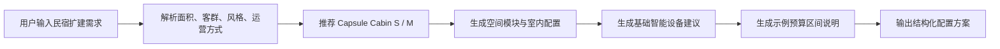
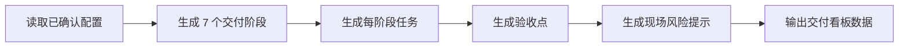
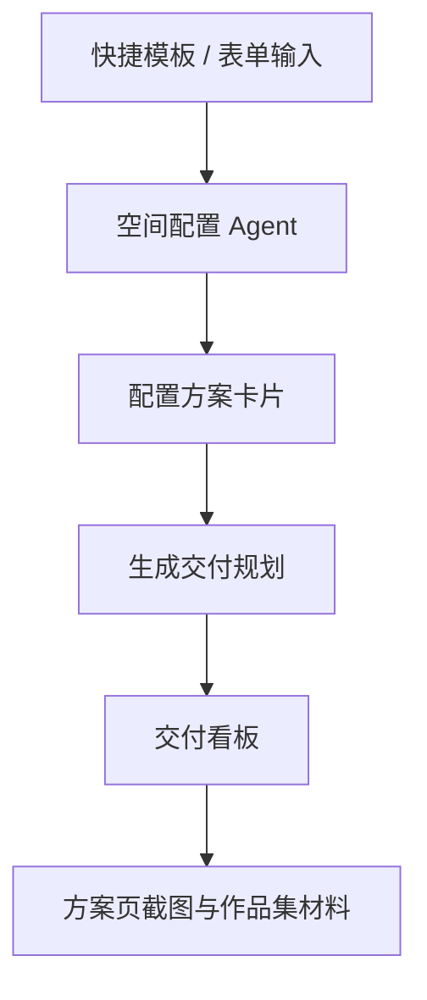

# Agent 工作流

## 空间配置 Agent

```mermaid
flowchart LR
  A["用户输入民宿扩建需求"] --> B["解析面积、客群、风格、运营方式"]
  B --> C["推荐 Capsule Cabin S / M"]
  C --> D["生成空间模块与室内配置"]
  D --> E["生成基础智能设备建议"]
  E --> F["生成示例预算区间说明"]
  F --> G["输出结构化配置方案"]
```

## 交付规划 Agent

```mermaid
flowchart LR
  A["读取已确认配置"] --> B["生成 7 个交付阶段"]
  B --> C["生成每阶段任务"]
  C --> D["生成验收点"]
  D --> E["生成现场风险提示"]
  E --> F["输出交付看板数据"]
```

## Demo 闭环

```mermaid
flowchart TD
  A["快捷模板 / 表单输入"] --> B["空间配置 Agent"]
  B --> C["配置方案卡片"]
  C --> D["生成交付规划"]
  D --> E["交付看板"]
  E --> F["方案页截图与作品集材料"]
```
