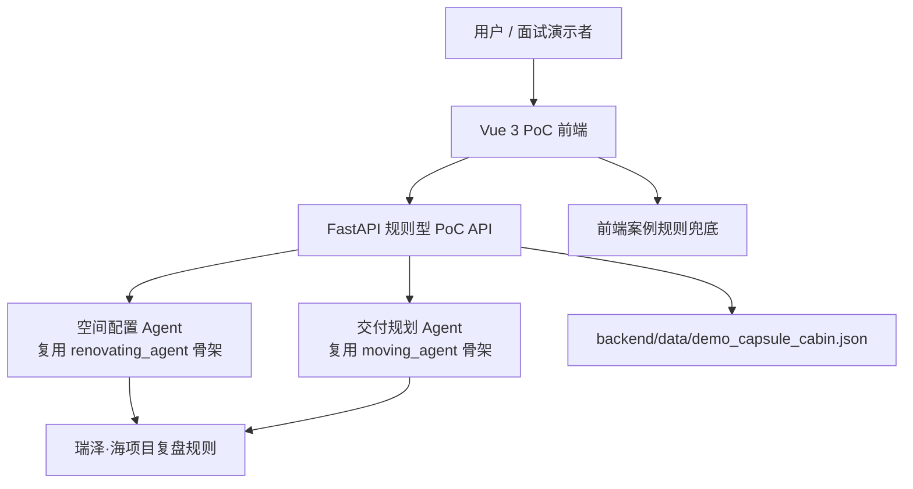

# 轻量系统架构

```mermaid
flowchart TB
  U["用户 / 面试演示者"] --> FE["Vue 3 PoC 前端"]
  FE --> API["FastAPI 规则型 PoC API"]
  API --> SA["空间配置 Agent<br/>复用 renovating_agent 骨架"]
  API --> DA["交付规划 Agent<br/>复用 moving_agent 骨架"]
  SA --> Rules["瑞泽·海项目复盘规则"]
  DA --> Rules
  API --> JSON["backend/data/demo_capsule_cabin.json"]
  FE --> LocalRules["前端案例规则兜底"]
```

## 设计取舍

- 优先规则型 PoC 模式，不要求登录。
- 不依赖 Docker、Redis、PostgreSQL 或复杂 RAG。
- LLM/RAG 不可用时使用项目复盘规则，保证演示可运行。
- 保留原项目目录，不进行大规模重构。
- 数据暂以结构化案例 JSON、接口返回和前端案例规则兜底展示为主。
